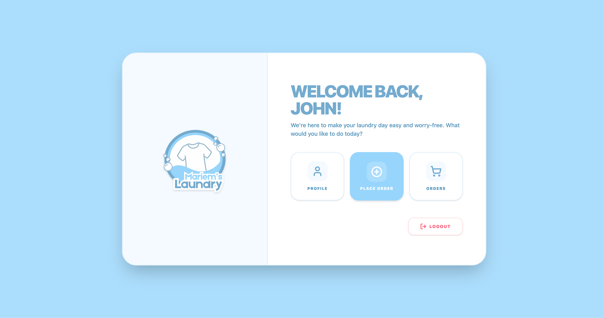
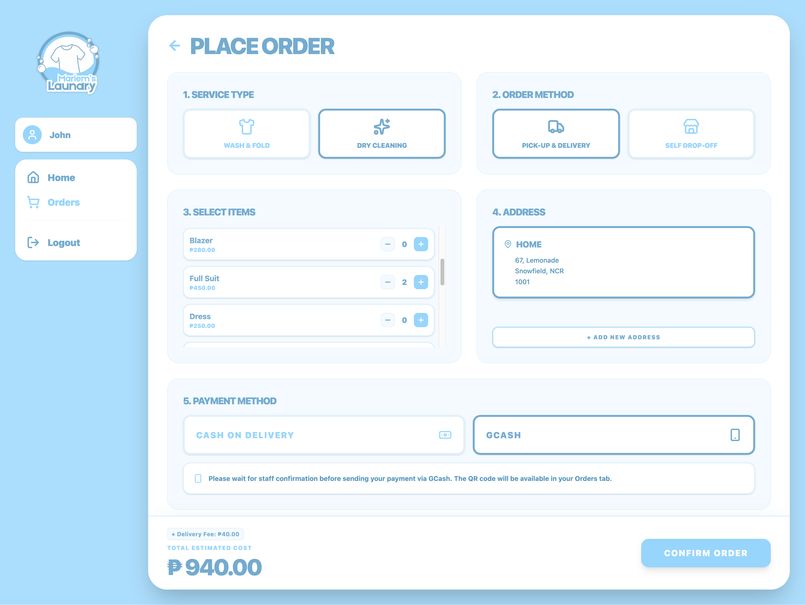
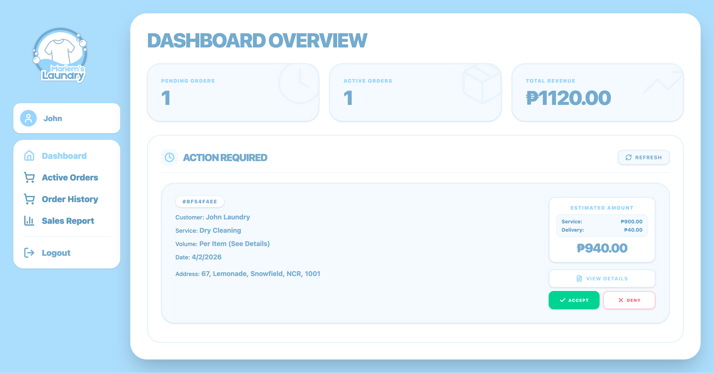

<div align="center">
<h1>🧺 Mariem’s Laundry Order Management System</h1>
<a href="#"></a> 
<a href="#"></a>
<a href="#">
</a> <a href="#"></a> <a href="#"></a>
</div><br>


## 📖 Description

**Mariem’s Laundry Order Management System** is a full-stack web application built to streamline daily laundry service operations. It provides a seamless experience for customers to place and track orders while equipping administrators with a powerful dashboard to manage workflows, verify payments, and analyze sales data in real time.

---

## ✨ Key Features

### 👤 Customer Experience

* **Flexible Order Placement:** Supports both *Pick-up & Delivery* and *Self Drop-off*
* **Dynamic Pricing Models:** Calculates totals based on weight (*Per Load*) or garments (*Per Item*)
* **Payment Integration:** Cash on Delivery (COD) and GCash with receipt upload support
* **Profile Management:** Manage multiple addresses and account details
* **Real-Time Tracking:** View active orders and order history

### 👑 Admin Dashboard

* **Order Workflow Management:** Handle statuses (Pending, Accepted, In Progress, Ready for Pickup, Claimed)
* **Inline Editing:** Adjust weights and item quantities before billing
* **Payment Verification:** Review and approve/reject uploaded receipts
* **Sales Analytics:** Track revenue, order trends, and export reports
* **Secure Access:** Role-based authentication for admin routes

---

## 🛠️ Tech Stack

* **Frontend:** React, Vite, React Router DOM
* **Styling:** Tailwind CSS, Lucide React
* **Backend & Database:** Supabase (PostgreSQL, Auth, Storage)
* **Deployment:** Vercel

---

## 🚀 Local Setup

1. **Clone the repository**

```bash
git clone https://github.com/yourusername/mariems-laundry.git
cd mariems-laundry
```

2. **Install dependencies**

```bash
npm install
```

3. **Configure environment variables**

Create a `.env` file in the root directory:

```env
VITE_SUPABASE_URL=your_supabase_project_url
VITE_SUPABASE_ANON_KEY=your_supabase_anon_key
```

4. **Run the development server**

```bash
npm run dev
```

---

## 📂 Project Structure

```id="uxd8f2"
mariems-laundry/
├── docs/images/            # Screenshots and demo assets
├── public/                 # Static assets
├── src/
│   ├── assets/             # Images, logos, icons
│   ├── components/         # Reusable UI components
│   ├── lib/                # Supabase client
│   ├── pages/              # Application pages
│   ├── App.jsx             # App router
│   └── main.jsx            # Entry point
├── package.json
├── vite.config.js
```

---

## 📸 Screenshots

### Customer Dashboard



### Place Order



### Admin Dashboard



---

## 📝 License

Licensed under the [MIT License](./LICENSE).